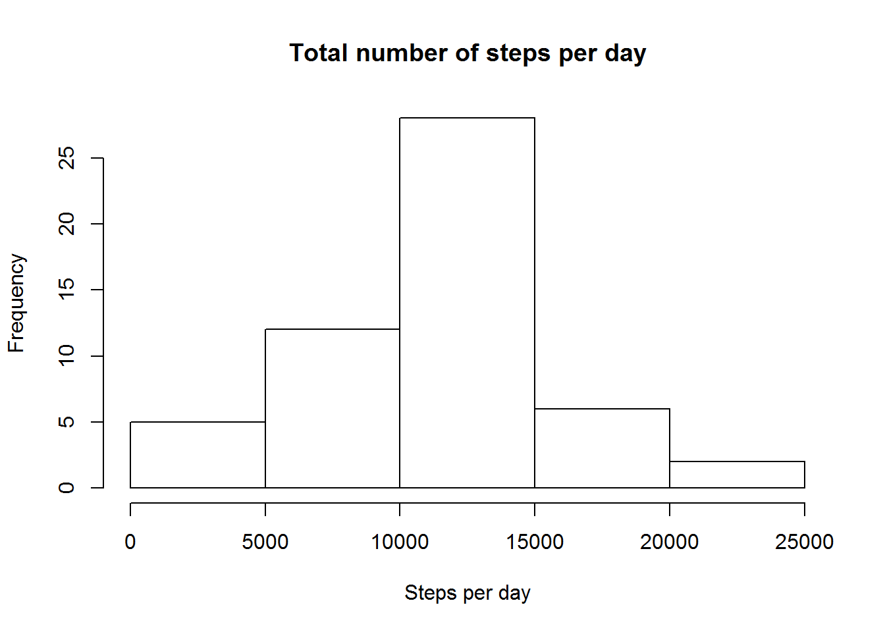

# Reproducible Research: Peer Assessment 1
jalagon  


## Loading and preprocessing the data

First, download the data from internet.


```r
URL <- "https://d396qusza40orc.cloudfront.net/repdata%2Fdata%2Factivity.zip"
download.file(url = URL, destfile = "activity.zip")
unzip("activity.zip")
```

Now read data in R, change date variable to date format and check everything looks ok.


```r
# Read data. I assume you have downloaded zip data and extracted *activity.csv*  to working directory.
activity <- read.csv("activity.csv")
# Change date variable to date format
activity$date<-as.Date.factor(activity$date)
# Explore data frame
str(activity)
```

```
## 'data.frame':	17568 obs. of  3 variables:
##  $ steps   : int  NA NA NA NA NA NA NA NA NA NA ...
##  $ date    : Date, format: "2012-10-01" "2012-10-01" ...
##  $ interval: int  0 5 10 15 20 25 30 35 40 45 ...
```

```r
head(activity)
```

```
##   steps       date interval
## 1    NA 2012-10-01        0
## 2    NA 2012-10-01        5
## 3    NA 2012-10-01       10
## 4    NA 2012-10-01       15
## 5    NA 2012-10-01       20
## 6    NA 2012-10-01       25
```

```r
tail(activity)
```

```
##       steps       date interval
## 17563    NA 2012-11-30     2330
## 17564    NA 2012-11-30     2335
## 17565    NA 2012-11-30     2340
## 17566    NA 2012-11-30     2345
## 17567    NA 2012-11-30     2350
## 17568    NA 2012-11-30     2355
```


## What is mean total number of steps taken per day?

1. Calculate the total number of steps taken per day


```r
library(dplyr, quietly = TRUE, warn.conflicts = FALSE)
#Calculate total number of steps per day
StepsPerDay <- summarise(group_by(activity, date), sum(steps))
StepsPerDay
```

```
## Source: local data frame [61 x 2]
## 
##          date sum(steps)
##        (date)      (int)
## 1  2012-10-01         NA
## 2  2012-10-02        126
## 3  2012-10-03      11352
## 4  2012-10-04      12116
## 5  2012-10-05      13294
## 6  2012-10-06      15420
## 7  2012-10-07      11015
## 8  2012-10-08         NA
## 9  2012-10-09      12811
## 10 2012-10-10       9900
## ..        ...        ...
```

2. Make a histogram of the total number of steps taken each day

```r
hist(StepsPerDay$`sum(steps)`,
     main = "Total number of steps per day",
     xlab = "Steps per day")
```

 


3. Calculate and report the mean and median of the total number of steps taken per day

```r
#Calculate mean and median across days, removing NA
mean(StepsPerDay$`sum(steps)`, na.rm = TRUE)
```

```
## [1] 10766.19
```

```r
median(StepsPerDay$`sum(steps)`, na.rm = TRUE)
```

```
## [1] 10765
```


## What is the average daily activity pattern?


## Imputing missing values


## Are there differences in activity patterns between weekdays and weekends?
