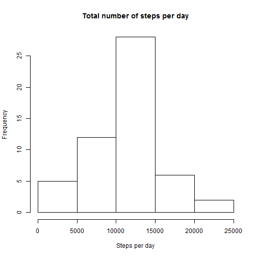
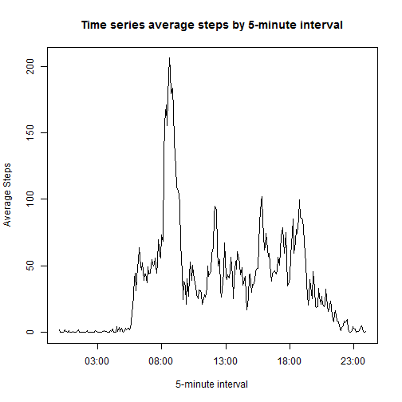
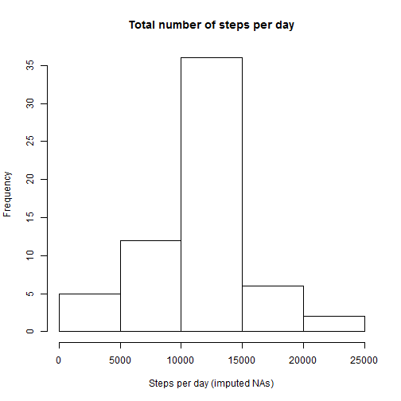
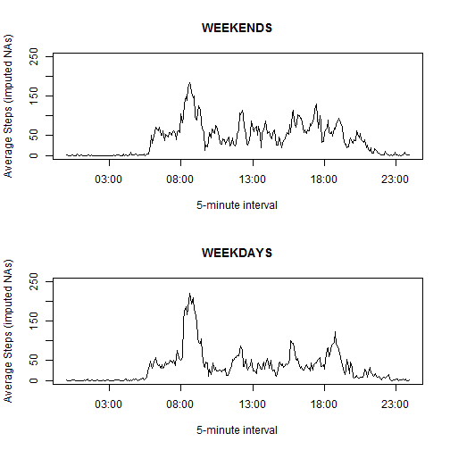

## Loading and preprocessing the data

1. Load the data (i.e. `read.csv()`)

First, download the data from internet.


```r
URL <- "https://d396qusza40orc.cloudfront.net/repdata%2Fdata%2Factivity.zip"
download.file(url = URL, destfile = "activity.zip")
unzip("activity.zip")
```

Then, read data in R.


```r
# Read data. I assume you have downloaded zip data and extracted *activity.csv*  to working directory.
activity <- read.csv("activity.csv")
```

2. Process/transform the data (if necessary) into a format suitable for your analysis.  

Change date variable to date format and check everything looks ok

```r
# Change date variable to date format
activity$date<-as.Date.factor(activity$date)

#Create time and dateTime variables from date and interval variables.
hour <- as.integer(activity$interval/100)
minute <- as.integer(round((activity$interval/100 - hour) * 100))
time <- strptime(paste(hour,":",minute, sep = ""), format = "%H:%M")
dateTime <- strptime(paste(activity$date," ",hour,":",minute, sep = ""), format = "%Y-%m-%d %H:%M")

# Explore data frame
str(activity)
```

```
## 'data.frame':	17568 obs. of  3 variables:
##  $ steps   : int  NA NA NA NA NA NA NA NA NA NA ...
##  $ date    : Date, format: "2012-10-01" "2012-10-01" ...
##  $ interval: int  0 5 10 15 20 25 30 35 40 45 ...
```

```r
head(activity)
```

```
##   steps       date interval
## 1    NA 2012-10-01        0
## 2    NA 2012-10-01        5
## 3    NA 2012-10-01       10
## 4    NA 2012-10-01       15
## 5    NA 2012-10-01       20
## 6    NA 2012-10-01       25
```

```r
tail(activity)
```

```
##       steps       date interval
## 17563    NA 2012-11-30     2330
## 17564    NA 2012-11-30     2335
## 17565    NA 2012-11-30     2340
## 17566    NA 2012-11-30     2345
## 17567    NA 2012-11-30     2350
## 17568    NA 2012-11-30     2355
```


## What is mean total number of steps taken per day?

1. Calculate the total number of steps taken per day


```r
library(plyr)
library(dplyr)
# Calculate total number of steps per day
StepsPerDay <- summarise(group_by(activity, date), sum(steps))
StepsPerDay
```

```
## Source: local data frame [61 x 2]
## 
##          date sum(steps)
##        (date)      (int)
## 1  2012-10-01         NA
## 2  2012-10-02        126
## 3  2012-10-03      11352
## 4  2012-10-04      12116
## 5  2012-10-05      13294
## 6  2012-10-06      15420
## 7  2012-10-07      11015
## 8  2012-10-08         NA
## 9  2012-10-09      12811
## 10 2012-10-10       9900
## ..        ...        ...
```

2. Make a histogram of the total number of steps taken each day

```r
hist(StepsPerDay$`sum(steps)`,
     main = "Total number of steps per day",
     xlab = "Steps per day")
```

 


3. Calculate and report the mean and median of the total number of steps taken per day

```r
# Calculate mean and median across days, ignoring NA
meanSteps <- mean(StepsPerDay$`sum(steps)`, na.rm = TRUE)
medianSteps <- median(StepsPerDay$`sum(steps)`, na.rm = TRUE)
```

The mean and median steps taken per day are **1.0766189 &times; 10<sup>4</sup>** and **10765**, respectively.

## What is the average daily activity pattern?

1. Make a time series plot (i.e. `type = "l"`) of the 5-minute interval (x-axis) and the average number of steps taken, averaged across all days (y-axis)

```r
# Calculate Average Steps per Interval
AverageStepsPerInterval <- summarise(group_by(activity, interval), mean(steps, na.rm = TRUE))
plot(unique(time), AverageStepsPerInterval$`mean(steps, na.rm = TRUE)`, 
     type = "l",
     main = "Time series average steps by 5-minute interval",
     xlab = "5-minute interval",
     ylab = "Average Steps")
```

 

2. Which 5-minute interval, on average across all the days in the dataset, contains the maximum number of steps?

```r
# Find the max and extract the interval
x <- AverageStepsPerInterval[AverageStepsPerInterval[, 2] == max(AverageStepsPerInterval[, 2]), ]
maxInt <- paste(as.integer(x[1] / 100), ":", 
                as.integer(round((x[1] / 100 - as.integer(x[1] / 100)) * 100)), 
                sep = "")
maxSteps <- round(x[2])
```

The interval **8:35** has the max average number of steps, which is **206**.

## Imputing missing values

1. Calculate and report the total number of missing values in the dataset (i.e. the total number of rows with NAs)


```r
#Calculate number of rows with NAs
numbMissing <- dim(activity)[1] - sum(complete.cases(activity))
percMissing <- round(numbMissing / dim(activity)[1] * 100)
```

There are **2304** cases with missing values, that is **13%**.

2. Devise a strategy for filling in all of the missing values in the dataset. 

My strategy will be **to replace missing values by the mean for that 5-minute interval**.

3. Create a new dataset that is equal to the original dataset but with the missing data filled in.


```r
# Used approach from http://www.mail-archive.com/r-help@r-project.org/msg58289.html
impute.mean <- function(x) replace(x, is.na(x), mean(x, na.rm = TRUE))
activityComplete <- ddply(activity, ~ interval, transform, steps = impute.mean(steps))
```

4. Make a histogram of the total number of steps taken each day and Calculate and report the mean and median total number of steps taken per day. Do these values differ from the estimates from the first part of the assignment? What is the impact of imputing missing data on the estimates of the total daily number of steps?


```r
# Calculate total number of steps per day
StepsPerDayComplete <- summarise(group_by(activityComplete, date), sum(steps))
# Generate Histogram
hist(StepsPerDayComplete$`sum(steps)`,
     main = "Total number of steps per day",
     xlab = "Steps per day (imputed NAs)")
```

 

```r
# Calculate mean and median across days
meanStepsComplete <- round(mean(StepsPerDayComplete$`sum(steps)`), digits = 2)
medianStepsComplete <- round(median(StepsPerDayComplete$`sum(steps)`), digits = 2)
```

The mean and median steps taken per day are both **1.076619 &times; 10<sup>4</sup>**. 

Therefore, the impact of imputing missing data was **negligible**.

## Are there differences in activity patterns between weekdays and weekends?

For this part the weekdays() function may be of some help here. Use the dataset with the filled-in missing values for this part.

1. Create a new factor variable in the dataset with two levels â<U+0080><U+0093> *weekday* and *weekend* indicating whether a given date is a weekday or weekend day.


```r
Semana <- c("lun", "mar", "mié", "jue", "vie")
activityComplete$weekday <- 
        factor(weekdays(activityComplete$date, abbreviate = TRUE) %in% Semana,
                levels=c(FALSE, TRUE),
                labels=c('weekend', 'weekday')
        )
str(activityComplete)
```

```
## 'data.frame':	17568 obs. of  4 variables:
##  $ steps   : num  1.72 0 0 47 0 ...
##  $ date    : Date, format: "2012-10-01" "2012-10-02" ...
##  $ interval: int  0 0 0 0 0 0 0 0 0 0 ...
##  $ weekday : Factor w/ 2 levels "weekend","weekday": 2 2 1 2 2 1 1 2 2 1 ...
```

2. Make a panel plot containing a time series plot (i.e. type = "l") of the 5-minute interval (x-axis) and the average number of steps taken, averaged across all weekday days or weekend days (y-axis). See the README file in the GitHub repository to see an example of what this plot should look like using simulated data.


```r
# Calculate Average Steps per Interval per weekday/weekend
AverageStepsPerIntervalComplete <- summarise(group_by(activityComplete, interval, weekday), mean(steps))
#Subset
AverageStepsPerIntervalCompleteWeekend <- subset(AverageStepsPerIntervalComplete, weekday=="weekend")
AverageStepsPerIntervalCompleteWeekday <- subset(AverageStepsPerIntervalComplete, weekday=="weekday")
#Plot
par(mfrow=c(2,1))
plot(unique(time), AverageStepsPerIntervalCompleteWeekend$`mean(steps)`, 
     type = "l",
     main = "WEEKENDS",
     xlab = "5-minute interval",
     ylab = "Average Steps (imputed NAs)",
     ylim  = c(0,250))
plot(unique(time), AverageStepsPerIntervalCompleteWeekday$`mean(steps)`, 
     type = "l",
     main = "WEEKDAYS",
     xlab = "5-minute interval",
     ylab = "Average Steps (imputed NAs)",
     ylim  = c(0,250))
```

 

Thank you.
